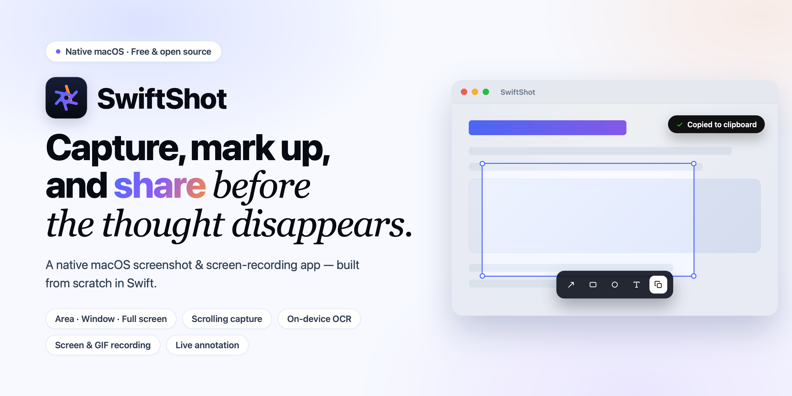
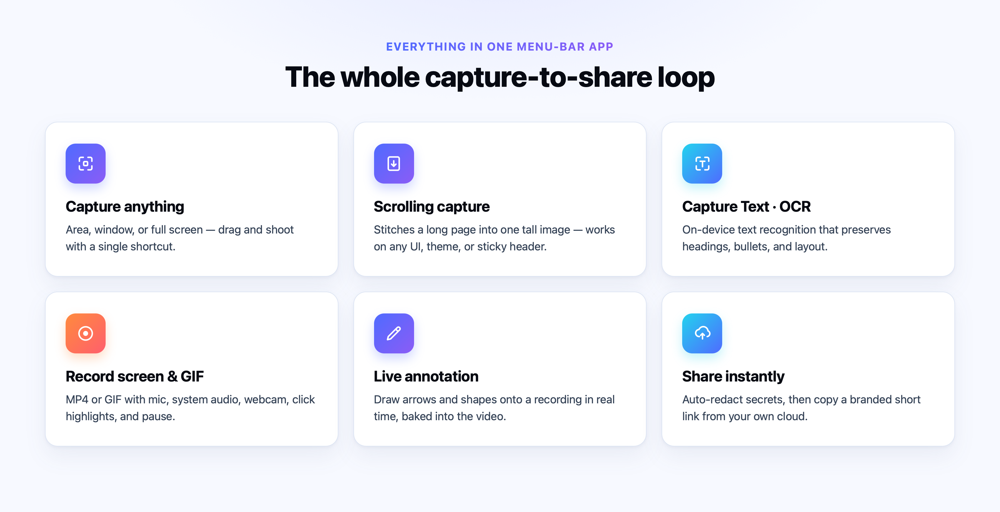

<div align="center">
  

  <p>
    
    
    
    
  </p>

  <p><a href="../../releases/latest"><strong>⬇︎ Download for macOS</strong></a></p>
</div>

---

SwiftShot lives in your menu bar and does the whole capture-to-share loop: fast capture modes, scrolling screenshots, on-device text recognition, full screen recording with a live annotation layer, a SwiftUI editor, and one-click cloud links — all native, all on-device, no Electron.



> **Status:** feature-complete personal project, distributed free. It's a portfolio piece — the interesting parts are the engineering (see [Under the hood](#under-the-hood)).

## ✨ Features

**Capture**
- **Area · Window · Full screen** capture (`⌥⇧4` / `⌥⇧2` / `⌥⇧3`)
- **Scrolling capture** (`⌥⇧5`) — timer-driven frame stitching that reconstructs a tall page from a scroll, with relative/texture-gated alignment so it works on any UI (dark chat themes, sticky headers, animated columns)
- **Capture Text / OCR** (`⌥⇧1`) — Vision-powered text recognition that *preserves layout*: headings, numbered steps, bullets, indentation, and columns survive the copy. QR/barcode fallback included.

**Record**
- **Screen recording** (`⌥⇧6`) — video (`.mp4`) or animated **GIF**, region or window
- **Microphone + system audio**, **webcam overlay** (draggable, circle or rounded-rect), **click highlights**, and **keystroke** display
- **Pause/resume** with seamless timeline retiming, **trim editor** with a filmstrip scrubber
- **Live annotation while recording** — draw arrows / shapes / freehand directly onto the recording in real time

**Edit & organize**
- SwiftUI **editor**: arrows, shapes, blur/redaction, highlighter, text, crop, backgrounds
- **Auto-redaction** — detects emails, API keys, credit cards, tokens via OCR and blurs them in one click
- **Quick-action cards**, **pinned screenshots**, and a **searchable history library** (OCR-indexed)
- **Cloud sharing** — uploads to your own Cloudflare R2 bucket and copies a branded short link (see [`cloudflare-worker/`](cloudflare-worker/))

**Make it yours**
- Customizable global hotkeys, save location / format (PNG·JPEG·HEIC), filename templates, launch-at-login

## 📦 Install

### Download (recommended)
1. Grab **`SwiftShot.dmg`** from the [latest release](../../releases/latest).
2. Open the DMG and drag **SwiftShot** to **Applications**.
3. **First launch only** — because the app is free & not Apple-notarized, macOS asks you to approve it once:
   - Double-click SwiftShot → in the dialog, open **System Settings → Privacy & Security**, scroll down, and click **Open Anyway**.
   - *Or* run once in Terminal: `xattr -dr com.apple.quarantine /Applications/SwiftShot.app`
4. That's it — it opens normally from then on. Grant **Screen Recording** when prompted (every screenshot app needs this).

### Build from source (zero warnings)
Locally-built apps aren't quarantined, so there's no approval step:
```bash
git clone https://github.com/pirzada-ahmadfaraz/swiftshot-mac.git
cd swiftshot-mac
./package-release.sh      # → SwiftShot.app + SwiftShot.dmg
open SwiftShot.app
```
Requires macOS 14+ and the Swift toolchain (Xcode or Command Line Tools).

## 🧠 Under the hood

The parts I'm proud of:

- **Scrolling-capture stitcher** (`Capture/ImageStitcher.swift`) — aligns consecutive frames with per-row segment signatures and *relative* accept gates (beats chance + zero-shift + a 2-of-3 pixel vote), so it self-calibrates to any theme instead of using absolute thresholds. Handles sticky headers/footers, animated avatars, and periodic chat layouts.
- **OCR layout reconstruction** (`OCR/TextRecognizer.swift`) — turns Vision's flat text fragments back into structured text using gap statistics for paragraph breaks and character-width units for indentation.
- **Live recording annotation** (`Recording/AnnotationController.swift`) — an overlay composited into the ScreenCaptureKit stream via selective window exclusion + load-bearing window levels, so chrome stays clickable while drawings are recorded.
- **Recording engine** (`Recording/`) — SCStream → AVAssetWriter with pause via presentation-timestamp retiming, system-audio + mic tracks, and a streaming GIF encoder.
- **Self-hosted cloud** (`cloudflare-worker/`) — a Cloudflare Worker + R2 that takes an authenticated upload and serves a branded, theme-matched viewer page (with Open Graph unfurls) for `<token>` links.

**Stack:** Swift · AppKit + SwiftUI · ScreenCaptureKit · AVFoundation · Vision · Core Graphics · Cloudflare Workers + R2.

## 🗂 Project layout

```
Sources/CleanShotClone/   # the app (SwiftPM executable target)
  Capture/ · OCR/ · Recording/ · Editor/ · QuickActions/
  Preferences/ · History/ · Cloud/ · Redaction/ · MenuBar/ · Hotkeys/
cloudflare-worker/        # upload + branded image-viewer Worker
package-release.sh        # build the signed .app + .dmg
```

The marketing site ([swiftshot.online](https://swiftshot.online)) lives in its own repo.

## 📄 License

[MIT](LICENSE) © 2026 Ahmad Faraz
